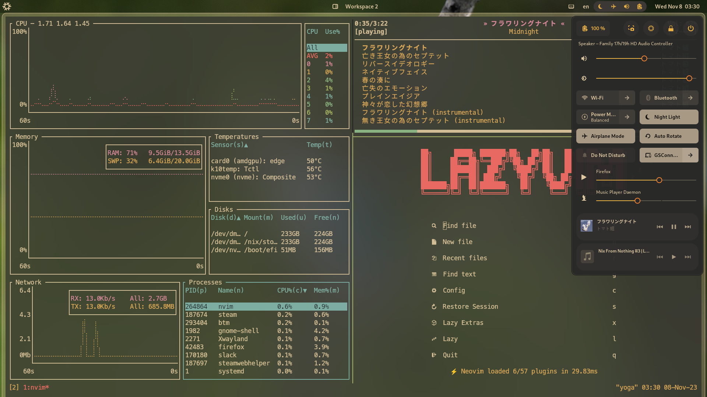
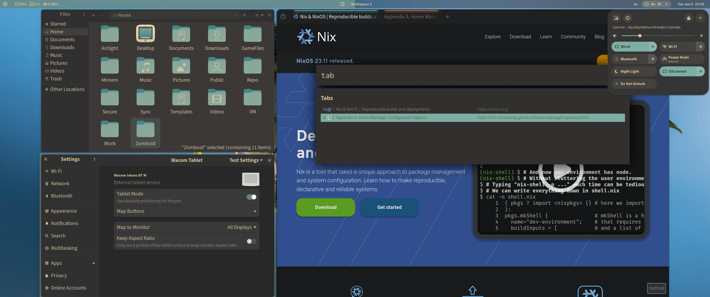

# Arclight NixOS

<a href="https://nixos.wiki/wiki/Flakes" target="_blank">
	
</a>
<a href="https://github.com/snowfallorg/lib" target="_blank">
	
</a>

<p>
<!--
	This paragraph is not empty, it contains an em space (UTF-8 8195) on the next line in order
	to create a gap in the page.
-->
  
</p>

> ⚠️ WARNING: I no longer use Nix as of 28/10/24 nor do I endorse anyone to use it anymore due to NixOS Foundation's decision to support defense industry over its community members. I will still keep this flake up as a reference for anyone still interested in the project. But until the leadership is changed, consider this flake abandoned.

- [Screenshots](#screenshots)
- [Disclaimer](#disclaimer)
- [Overview](#overview)
- [Acknowledgements](#acknowledgements)
- [Overlays](#overlays)

## Screenshots






## Disclaimer

This NixOS flake is a culmination of whatever code snippets I've scraped off GitHub, LLMs, and random blog posts to form a desktop environment that best suits my workflow. I am neither a Nix expert nor a programmer, so it's very likely that you will see a lot of hacky abominations in this repo due to some of the very questionable design choices I made learning Nix (and Linux in general). Feel free to steal anything from here you find useful, or open issues if you have questions.

## Overview

🚧 WIP 🚧  

Will probably write an entire blog post about this once I feel more comfortable with the nuts and bolts of Nix and `snowfall-lib`, but in short:
- Desktop Environment: GNOME 44. While I don't fully agree with many recent design choices, it has the best support for touchscreen and drawing tablet which I use on a daily basis. Also, 100% declarative configuration possible through dconf.
  - Important extensions to my workflow:
    - [PaperWM](https://github.com/paperwm/PaperWM): Excellent GNOME window manager with very unique approach to tilling. Very good for documentation-heavy workflow (I still use [tilish](https://github.com/jabirali/tmux-tilish) in `tmux` for actual dynamic tiling when doing anything programming related).
    - [run-or-raise](https://github.com/CZ-NIC/run-or-raise): Lets you bind application to keyboard shortcuts and launch them if it isn't open, or jump your focus there if it already is. Basically lets you access everything in your system at your fingertips as long as you know `WM_CLASS` or `WM_TITLE` of the application. Extreme productivity booster that I want to see being implemented everywhere.
- Browser: Firefox, with [Arkenfox](https://github.com/arkenfox/user.js/) hardening. Configured through [arkenfox-nixos](https://github.com/dwarfmaster/arkenfox-nixos) home-manager module.
- Terminal: [kitty](https://github.com/kovidgoyal/kitty), the tried-and-true.
- Editor: [LazyVim](https://github.com/LazyVim/LazyVim), a neovim distribution. I manage all the dependencies through nix, but configure neovim itself and plugins through LazyVim impurely through `fetch-mutable-file` module. This has the benefit of not requiring a system rebuild after every little tweaks while still keeping admin overhead low.
- Secrets management: [sops-nix](https://github.com/Mic92/sops-nix) for now. Still looking for solutions that can be used during evaluation phase securely (or just waiting until most NixOS options support passing files).

## Acknowledgements

- [Jake Hamilton](https://github.com/jakehamilton) - for the phenomenal [snowfall-lib](https://github.com/snowfallorg/lib) that actually makes nixpkgs incantations understandable to mere mortals. This entire flake mirrors Jake Hamilton's own NixOS configuration, but mostly stripped down to just the software I use to keep my birdbrain from imploding. Please go check out his [documentation](https://snowfall.org/guides/lib/quickstart/) and [Youtube channel](https://www.youtube.com/@jakehamiltondev) if you're interested as to why the repository is organized this way.
- [Foodogsquaredone](https://www.foodogsquared.one/) - for the idea of managing some dotfiles on NixOS systems out-of-band with [fetch-mutable-file](https://github.com/foo-dogsquared/nixos-config/blob/master/modules/home-manager/files/mutable-files.nix) home-manager module. Please take a look at [this](https://www.foodogsquared.one/posts/2023-03-24-managing-mutable-files-in-nixos/) blog post. It's a really good read.
- [Dwarfmaster](https://github.com/dwarfmaster) - for the fantastic [arkenfox-nixos](https://github.com/dwarfmaster/arkenfox-nixos) home-manager module, which exposes of Arkenfox hardening tweaks as home-manager options. Very useful to have 100% declarative browser setup geared for navigating through the minefield that is privatized internet.
- [Vimjoyer](https://github.com/vimjoyer/) - I don't necessarily have anything yoinked from him in here, but his videos are so good that it manages to make me understand enough about NixOS to make a complete switch. Please check out his [Youtube channel](https://www.youtube.com/@vimjoyer) if you're intrigued about Nix ecosystem, but have a hard time making sense of anything due to fragmented documentation.

## Overlays

I have some packages declared through `snowfall-lib` for my personal use, which should be exposed through the following overlays by default. If you plan to actually use these, just grab the derivation or take the idea and use it in your own flake because I mostly do not have time to maintain them. I also use some of the packaged shell scripts declared through Jake Hamilton's [Plus Ultra](https://github.com/jakehamilton/config) flake, so please go check those out as well.

```nix
{
	description = "";

	inputs = {
		nixpkgs.url = "github:nixos/nixpkgs/release-23.05";
		unstable.url = "github:nixos/nixpkgs";

		snowfall-lib = {
			url = "github:snowfallorg/lib";
			inputs.nixpkgs.follows = "nixpkgs";
		};

		arclight = {
			url = "github:arclight443/config";
			inputs.nixpkgs.follows = "nixpkgs";
			inputs.unstable.follows = "unstable";
		};
	};

	outputs = inputs:
		inputs.snowfall-lib.mkFlake {
			inherit inputs;

			src = ./.;

			overlays = with inputs; [
				# Get all of the packages from this flake by using the main overlay.
				arclight.overlays.default

				# Individual overlays can be accessed from
				# `arclight.overlays.<name>`.

				# Individual overlays for each package in this flake
				# are available for convenience.
				arclight.overlays."package/firefox-cascade"               # Firefox one-liner theme with some of my tweaks used in the screenshot
				arclight.overlays."package/firefox-csshacks"              # A bunch of useful Firefox CSS tweaks
				arclight.overlays."package/gather"                        # As much as I hate corpo virtual office bs, I need it to feed myself
				arclight.overlays."package/gnome-lock-all-sessions"       # Shell script that locks all active gnome sessions
				arclight.overlays."package/gruvbox-flat-nvim-extras"      # Gruvbox theme used for my kitty configuration
				arclight.overlays."package/gruvbox-plus"                  # Gruvbox icon theme you see used in my screenshots
				arclight.overlays."package/line"                          # Chat app everyone around here uses despite how absolutely proprietary it is
				arclight.overlays."package/paperwm"                       # Excellent GNOME tiler extension that suits my workflow
				arclight.overlays."package/zsh-nix-shell"                 # This sets your default shell in nix-shell to zsh
			];
		};
}
```
